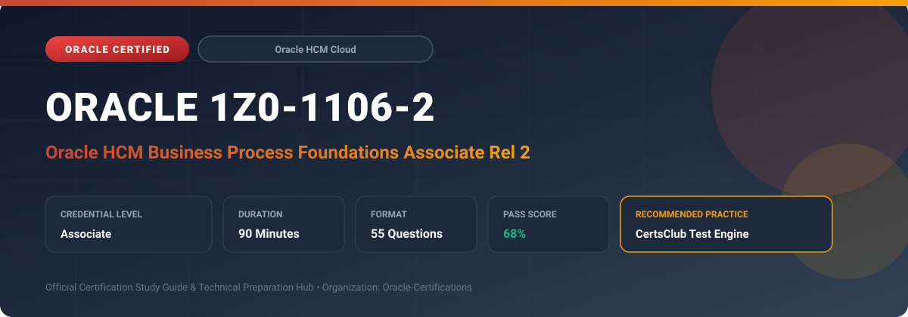

  

# Oracle 1Z0-1106-2: Oracle HCM Business Process Foundations Associate Rel 2

---

## 1. Exam Overview & Candidate Profile

The **Oracle 1Z0-1106-2: Oracle HCM Business Process Foundations Associate Rel 2** examination validates foundational understanding of modern Human Capital Management (HCM) business lifecycle processes.

Candidates demonstrate comprehension of workforce management, talent acquisition, hire-to-retire lifecycles, payroll operations, compensation and benefits, and employee self-service journeys.

### Target Audience & Prerequisites
- **Target Roles**: Implementation Specialists, Cloud Architects, Technical Leads, Enterprise Consultants, and Systems Engineers.
- **Recommended Experience**: 1–2 years of practical, hands-on experience designing, implementing, and maintaining corresponding Oracle solutions.
- **Credential Earned**: Associate Certification.

---

## 2. Key Exam Specifications

| Specification | Details |
| :--- | :--- |
| **Exam Code** | **Oracle 1Z0-1106-2** |
| **Official Title** | Oracle HCM Business Process Foundations Associate Rel 2 |
| **Certification Track** | Oracle HCM Cloud |
| **Exam Duration** | 90 Minutes |
| **Number of Questions** | 55 Questions |
| **Passing Score** | 68% |
| **Question Format** | Multiple Choice (Single/Multiple Answer), Scenario-Based Questions |
| **Delivery Provider** | Oracle University / Pearson VUE (Online Proctored or Test Center) |
| **Recommended Practice Engine** | [CertsClub Oracle Practice Tests](https://www.certsclub.com/oracle/1z0-1106-2-dumps.html) |

---

## 3. Official Blueprint & Exam Domain Breakdown

The examination assesses candidate competencies across core functional domains weighted as follows:

| Domain Area | Weighting |
| :--- | :--- |
| **Core HR & Hire-to-Retire Business Processes** | `30%` |
| **Talent Management & Performance Lifecycle** | `25%` |
| **Payroll Processing & Labor Cost Distribution** | `20%` |
| **Workforce Compensation & Benefits Administration** | `15%` |
| **Time, Attendance & Employee Journey Experience** | `10%` |

---

## 4. Deep Dive into Complex & Challenging Technical Topics

To secure a passing score on the 1Z0-1106-2 exam, candidates must master the following advanced concepts:

- Understanding enterprise workforce structure: enterprise, divisions, legal entities, business units, and departments.
- Hire-to-retire lifecycle workflows including applicant tracking, onboarding, transfers, promotions, and offboarding.
- Goal management, multi-rater performance evaluations, and succession planning cycles.
- Payroll processing cycles: retro-pay calculation, gross-to-net processing, and payment disbursement.
- Designing employee experience journeys using Oracle ME (My Experience).

---

## 5. Scenario-Based Demo & Practice Questions

### Question 1
In the standard Oracle HCM Hire-to-Retire lifecycle, which step transitions a selected external candidate into an active worker record with an assigned payroll and benefits eligibility?

A) Candidate Conversion / Onboarding
B) Requisition Approval
C) Job Sourcing Review
D) Exit Interview Workflow

- **Correct Answer**: `A) Candidate Conversion / Onboarding`  
- **Technical Explanation**: Candidate conversion moves a candidate from the recruitment funnel into Core HR as an employee or contingent worker, creating personal, employment, payroll, and benefit associations.

---

### Question 2
Which enterprise structure component represents the highest level in an Oracle HCM Cloud organization hierarchy and defines common global configurations?

A) Enterprise
B) Legal Entity
C) Business Unit
D) Department

- **Correct Answer**: `A) Enterprise`  
- **Technical Explanation**: The Enterprise represents the entire global organization and serves as the umbrella structure under which all divisions, legal entities, and business units reside.

---

## 6. Recommended Preparation Strategy & Practice Testing Engine

Achieving certification in **Oracle 1Z0-1106-2** requires balanced theoretical study and scenario-based simulation practice:

1. **Review Oracle Documentation**: Master architecture guides, implementation workbooks, and administration manuals on the Oracle Help Center.
2. **Hands-on Lab Practice**: Execute real-world configuration, policy setup, and troubleshooting tasks in your cloud tenancy or test instance.
3. **Simulated Exam Drills**: Practice answering timed, scenario-based multiple-choice questions to familiarize yourself with the question formats, traps, and timing constraints.

### Practice With CertsClub
For realistic practice questions, updated dumps, and mock testing environments:
- **Resource**: [CertsClub Oracle Practice Test Engine](https://www.certsclub.com/oracle/1z0-1106-2-dumps.html)
- **Special Discount**: Use coupon code **`club20`** during checkout for an instant **20% discount** on all practice exam bundles and testing engines.

---

## 7. Official Documentation & References

- [Oracle University Certification Registry](https://education.oracle.com/)
- [Oracle Help Center Documentation Portal](https://docs.oracle.com/)
- [Oracle Cloud Infrastructure & Applications Guides](https://docs.oracle.com/en/cloud/)
- [CertsClub Oracle Certification Exam Practice](https://www.certsclub.com/oracle/1z0-1106-2-dumps.html)

---

## 8. SEO & Discovery Keywords

`oracle 1z0-1106-2, oracle 1z0-1106-2 exam, oracle 1z0-1106-2 dumps, 1Z0-1106-2 practice questions, 1Z0-1106-2 study guide, oracle hcm business process foundations associate rel 2, certsclub 1z0-1106-2`